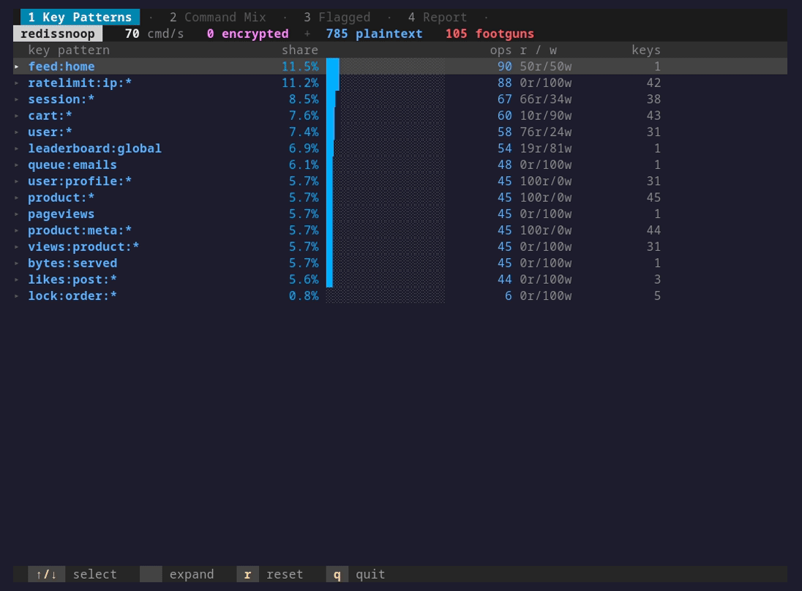

# `redissnoop`

> **tcpdump for your Redis queries.** Watch every command hit your server, encrypted or not, without touching the app.

<p align="center">
  
  
  
  
  <a href="https://discord.gg/dYZu9PjKB"></a>
</p>



**`redissnoop` is a live, zero-config profiler that shows what your application is actually doing to Redis, read straight from the kernel with eBPF.**

> [!TIP]
> No `MONITOR`, no proxy, no client changes, and no load on the server. It reads the Redis wire protocol at the socket layer, and hooks the TLS library to read encrypted traffic as plaintext before it is ever encrypted.

## Quick start

```sh
curl -fsSL https://yeet.cx | sh
yeet run https://github.com/yeet-src/redissnoop.git
```
<sub>[Manual install guide](https://yeet.cx/docs/install/manual-installation) | Linux only</sub>

Tab through the three views with `Tab` (or `1` / `2` / `3`). In a table, `↑` / `↓` selects a row and `Enter` expands it. `q` quits. The mouse works too: click a tab to switch to it, and click a row to select and expand it.

## A 60-second primer on watching Redis traffic

Redis speaks a simple text protocol called RESP. A `GET foo` goes over the socket as a small framed message; the reply comes back the same way. Tools that show you this traffic usually sit *in the path* (a proxy) or *ask the server* (`MONITOR`), and both have a cost.

| Term | What it means here |
|---|---|
| **RESP** | Redis's wire format. Plaintext and length-prefixed, so the first frame of a request is parseable without reassembling the whole stream. |
| **kprobe** | A kernel hook on a function. `redissnoop` hooks `tcp_sendmsg` to see commands as the kernel sends them. |
| **uprobe** | A hook on a *userspace* function. `redissnoop` hooks `SSL_write` in the TLS library to read the command **before** it gets encrypted. |
| **key pattern** | The shape of a key with the variable part collapsed: `user:1839` and `user:204` both become `user:*`. How traffic gets grouped. |
| **footgun** | A command that is cheap to type and expensive to run, like `KEYS *` (scans the whole keyspace and blocks the single-threaded server). |

The trick that makes `redissnoop` cheap: it never talks to Redis. It watches the kernel's socket and TLS calls, so Redis runs exactly as it would if the tool were not there.

## Common use cases

Backend developers chasing a Redis slowdown, and SREs auditing what a service does to a shared cache.

- Redis p95 climbed after a deploy. Which key pattern is eating the traffic?
- A shared cache feels slow. Which service, and which commands, are hammering it?
- Reviewing a service before launch. Is anything running `KEYS` or pulling whole collections?
- Production Redis is behind TLS. Can you still see what your app sends it?

## What you're looking at

A status bar across the top, three tabbed views below it, and a key-hint footer.

**Status bar.** Live commands per second, then the headline split: how many commands were seen **encrypted** versus **plaintext**, and a count of footgun commands observed. The encrypted/plaintext split is the proof that both capture paths are live at once.

**Tab 1, Report.** The opinionated view, and the one that opens first. A ranked list of findings, worst first: a footgun command in use, a single key pattern dominating traffic, a hot key inside a high-cardinality pattern, a write-only counter worth batching. It reads the other two tabs for you and surfaces what is worth acting on.

**Tab 2, Key Patterns.** Traffic grouped by key pattern (`user:*`, `session:*`, `cart:*`), ranked by share, with the read/write split and how many distinct keys each pattern spans. Expand a row to see its top commands and its hottest concrete keys. This is the "where is the load" view.

**Tab 3, Command Mix.** The same traffic grouped by command, with a **footgun** column that flags dangerous commands (`KEYS`, `FLUSHALL`, `SMEMBERS` and `HGETALL` on large collections, `SORT`). Expand a command to see which patterns and keys it runs against. This is the "what is it doing" view.

Rows are colored by capture source, so encrypted traffic and plaintext traffic are distinguishable at a glance across every view.

## How it works

**The BPF side.** One object, two programs, one ring buffer. Each event is tagged with the source it came from.

| Program | Hook | Captures |
|---|---|---|
| kprobe | `tcp_sendmsg`, `tcp_cleanup_rbuf` | Plaintext RESP on the wire, from any client |
| uprobe | `SSL_write` in `libssl` | RESP inside TLS connections, read before encryption |

The send-side program reads the request buffer out of the socket's `msg_iter` and parses the RESP command and key in-kernel. The uprobe reads the same plaintext from the application's own buffer at the TLS boundary.

**The JS side.**

- `src/probes/` is the only BPF-aware code. It loads the object, subscribes to the ring buffer once, and rolls the stream into plain reactive signals.
- `src/components/` and `src/lib/` are pure presentation reading those signals: the tab bar, the three views, the report heuristics, the theme.
- `src/main.jsx` wires them together and owns keyboard input.

**The data flow.** Kernel programs emit one struct per command into the ring buffer. The data layer aggregates by key pattern and by command, then publishes snapshots that the views render reactively.

## Requirements

> [!IMPORTANT]
> A kernel with BTF (`CONFIG_DEBUG_INFO_BTF=y`) and uprobe support (`CONFIG_UPROBES=y`). Both are on by default on current Ubuntu, Debian, and Fedora. The encrypted-capture path needs the Redis client to use a dynamically linked OpenSSL (`libssl`).

The yeet daemon, which handles the privileged BPF load. `curl -fsSL https://yeet.cx | sh` installs it.

## Honest caveats

> [!NOTE]
> What `redissnoop` does not do, and what it gets wrong.

- Plaintext capture only sees **TCP** traffic. A client connected over a Unix domain socket is not captured. Connect over TCP (`redis-cli -h 127.0.0.1`) to be seen.
- Encrypted capture is **OpenSSL-only**. An app that statically links its TLS (some Go builds use BoringSSL) has no `libssl` to hook, so its encrypted traffic is invisible. Dynamically linked OpenSSL, the common case, works. (extrapolated, grounding 2 — review)
- It is a **traffic profiler, not a latency profiler.** Per-command latency for server-blocking commands is not measured accurately and is not shown.
- Key-pattern grouping is a heuristic. It collapses numeric, hex, and uuid-like segments to `*`; an unusual key scheme may group in ways you do not expect.
- It reads command names and keys, not values. It is not a way to dump the contents of your database.

## Community questions

**Do I need to change my app or run a proxy?**
No. `redissnoop` attaches to the kernel and the TLS library from outside. Your app and your Redis server run unmodified.

**Will this slow down my Redis server like `MONITOR` does?**
No. `MONITOR` makes the server relay every command to a client, which adds real load. `redissnoop` never talks to the server; it watches the kernel, so the server's cost is zero.

**Why don't I see any traffic?**
The most common reason is a client connected over a Unix socket instead of TCP, or, for an encrypted connection, a client that statically links TLS. Connect over TCP to confirm capture.

**Is it safe to run against production?**
The capture path is passive and adds no load, which is the design goal. It does read command keys, so treat its output like any other tool that can see query metadata. (extrapolated, grounding 3 — review)

**How is this different from `redis-cli MONITOR` or `--hotkeys`?**
`MONITOR` is a live firehose that loads the server and shows raw commands with no aggregation. `--hotkeys` is a one-shot snapshot that needs an LFU eviction policy set. `redissnoop` is continuous, adds no server load, aggregates into patterns and commands, and reads encrypted traffic too.

## Building from source

```sh
make          # clang + bpftool compile the BPF, esbuild bundles the JS
make clean
```

Requires `clang`, `bpftool`, and `libbpf` headers for the BPF program, plus `node` and `npm` for the esbuild bundle step. The compiled BPF object and the bundled JS are gitignored; `make` regenerates them.

## License

The BPF program is `SEC("license") = "Dual BSD/GPL"`, required because it uses GPL-only kernel helpers. (extrapolated, grounding 1 — stated in source)

---

Built with [yeet](https://yeet.cx/docs/?utm_source=github&utm_medium=readme&utm_campaign=redissnoop), a JS runtime for writing eBPF programs on Linux machines. Join us on [discord](https://discord.gg/dYZu9PjKB?utm_source=github&utm_medium=readme&utm_campaign=redissnoop).
