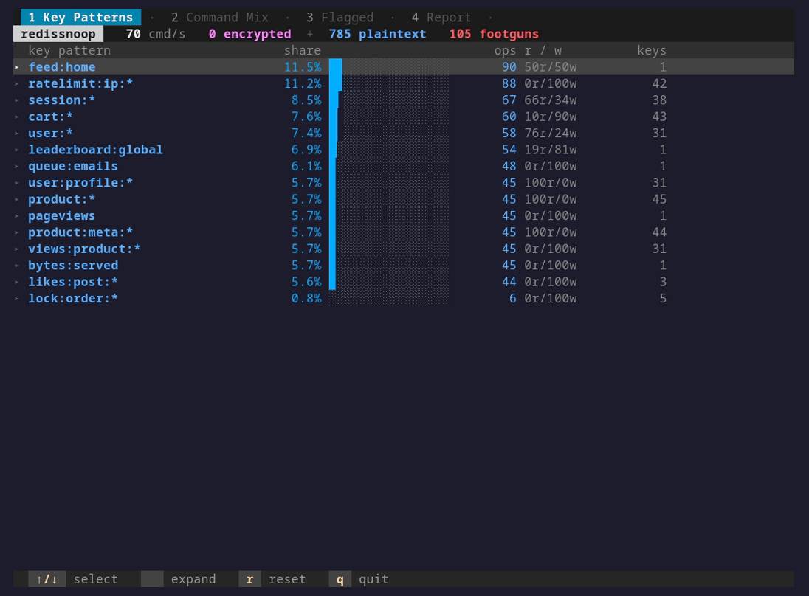

<!-- yeet:user-friendly-title: Inspect live Redis traffic -->
# `redissnoop`

> **`top` for the commands your app sends Redis.** Plaintext or TLS, read from the kernel, with nothing added to the app.

<p align="center">
  <a href="#requirements"></a>
  <a href="https://yeet.cx/docs/?utm_source=github&utm_medium=readme&utm_campaign=redissnoop&utm_content=badge"></a>
  <a href="#license"></a>
  <a href="#how-it-works"></a>
  <a href="https://discord.gg/JxVseaAVAU"></a>
</p>

<p align="center">
  
</p>

**`redissnoop` is a live terminal Redis traffic profiler for Linux: it ranks the key patterns and commands your app sends Redis, and flags the ones that block the server.**

## Quick start

```sh
curl -fsSL https://yeet.cx | sh   # install yeet, once
yeet run gh:yeet-src/redissnoop   # clone, build and run in one step
```

Redis is the part of the stack nobody has a log for. The application logs what it decided to do, and Redis logs almost nothing about what it was asked, so when a cache goes sideways the usual move is `redis-cli MONITOR` (which makes the server relay every command to you, adding real load to the thing that is already struggling) or a proxy in front of it (which means a deploy). `redissnoop` reads the same traffic from outside both processes, so the server does exactly what it would do if the tool were not running.

What you get is not a firehose. Commands are aggregated into key patterns (`user:*`, `session:*`), into a per-verb mix, and into a ranked list of findings: a `KEYS` in production, a single hot key inside a high-cardinality pattern, a write-only counter worth pipelining.

> [!TIP]
> Two capture paths run at once. A kprobe pair on `tcp_sendmsg` and `tcp_cleanup_rbuf` reads plaintext RESP off the socket and times the round trip, and a uprobe on `SSL_write` reads the command out of the app's own buffer *before* OpenSSL encrypts it. So a TLS-only Redis is not a blind spot, and the status bar shows both counts climbing side by side.

## Contents

**Run it** — [Get started](#get-started) · [Have an agent set it up](#have-an-agent-set-it-up) · [Without a TTY](#reading-it-without-a-tty) · [Demo traffic](#try-it-without-real-traffic)

**Understand it** — [A 60-second primer](#a-60-second-primer-on-watching-redis-traffic) · [Questions this tool answers](#questions-this-tool-answers) · [What you're looking at](#what-youre-looking-at) · [How it works](#how-it-works) · [What it can't see](#what-it-cant-see)

**Reference** — [Navigation](#navigation) · [Requirements](#requirements) · [FAQ](#faq) · [License](#license)

**Contribute** — [Building from source](#building-from-source) · [Testing across kernels](#testing-across-kernels)

## Get started

```sh
curl -fsSL https://yeet.cx | sh
yeet run gh:yeet-src/redissnoop
```
<sub>[Manual install guide](https://yeet.cx/docs/install/manual-installation?utm_source=github&utm_medium=readme&utm_campaign=redissnoop) | Linux only</sub>

That compiles the BPF object, bundles the JS, loads both capture paths and opens on the Key Patterns tab. There are no flags: the tool watches every Redis conversation on the host and starts counting. Working from a clone instead:

```sh
make            # compile bin/probe.bpf.o + bundle the JS (toolchain auto-fetched)
yeet run .
```

It runs until you quit, reflows on resize, and needs a real terminal. Don't pipe or redirect it; the TUI owns the screen. `q` or `Esc` quits, and `Ctrl-C` asks twice on purpose so a monitor you left open all afternoon does not die to a reflexive keystroke.

## Have an agent set it up

Paste this to a coding agent on the Linux box:

```
Set up and verify redissnoop from https://github.com/yeet-src/redissnoop.

1. Clone it (or `git pull` if it's already there) and read AGENTS.md before touching any code.
2. Run `make`. That fetches a static clang/bpftool toolchain into a per-machine cache,
   compiles src/bpf/redissnoop.bpf.c to bin/probe.bpf.o, and bundles the JS to src/index.jsx.
3. Make sure a Redis is listening on TCP, then start demo traffic: `bash demo/workload.sh`
   in its own shell. Leave it running.
4. Run `yeet run .` in a real terminal and confirm rows appear in the Key Patterns tab within
   a few seconds, and that the status bar's plaintext count is climbing.
5. Report back the top three key patterns by share, and whatever the Report tab (tab 4) lists.

Two traps. A client on a Unix domain socket is invisible to the TCP path, so the workload
script pins `-h 127.0.0.1` to force TCP; if you point it at a socket you get an empty table.
And "it compiled" is not the same as "it works": the only proof is rows on screen with a
climbing count, so don't report success off a clean `make`.
```

Prefer to drive it yourself? Everything the prompt does is in [Get started](#get-started) and [Try it without real traffic](#try-it-without-real-traffic).

## A 60-second primer on watching Redis traffic

Redis speaks a small text protocol called RESP. A `GET foo` leaves the client as `*2\r\n$3\r\nGET\r\n$3\r\nfoo\r\n`: an array header, then one length-prefixed bulk string per argument. Because it is plaintext and every field announces its own length, the front of a request is parseable on its own, without buffering the rest of the stream or reassembling anything. That property is what makes this tractable in a BPF program, which has neither a heap nor a loop it can run to completion.

| Term | What it means here |
|---|---|
| **RESP** | Redis's wire format. Plaintext and length-prefixed, so the first 64 bytes of a request are enough to lift the verb and the key. |
| **kprobe** | A hook on a kernel function. `redissnoop` hooks `tcp_sendmsg` (a command going out) and `tcp_cleanup_rbuf` (the reply being consumed). |
| **uprobe** | A hook on a *userspace* function. `redissnoop` hooks `SSL_write` in `libssl` to read a command **before** it is encrypted. |
| **key pattern** | A key with its variable segments collapsed: `user:1839` and `user:204` both become `user:*`. The unit of aggregation. |
| **footgun** | A command that is cheap to type and expensive to run, like `KEYS *`, which scans the whole keyspace and blocks a single-threaded server for the duration. |

The two hooks are the whole design, and each has a boundary the other covers, but they do not cover every case between them. The TCP path sees every plaintext client regardless of language or library, and a TLS connection is ciphertext by the time it gets there. The uprobe sees inside TLS, but only for a process whose OpenSSL is a shared library it can attach to. A client that encrypts without OpenSSL falls through both, which is the one blind spot worth knowing about before you trust an empty screen.

## Questions this tool answers

**I'm SSH'd into a box and Redis feels slow. What's the fastest way to see what's actually being sent?**
Two commands: install yeet, then `yeet run gh:yeet-src/redissnoop`. Nothing to install on the Redis host, no container, no port to forward, no client library. Within a second you have a live ranking of key patterns by share of traffic, and the Report tab tells you which of them is worth your attention first.

**How do I find out which key pattern is eating my Redis traffic when every key is unique?**
Keys are collapsed into patterns before they are counted, so `user:1839` and `user:204` are both `user:*`. You get one row per pattern with its share, its read/write split, and how many distinct keys it spans. Expand a row for its top commands and its hottest concrete keys, which is how a single hot key hiding inside a million-key pattern becomes visible. See [What you're looking at](#what-youre-looking-at).

**Is anything in my codebase running `KEYS` against production?**
The Flagged tab is a live tail of exactly that: only the commands a lint rule fires on, newest first, with the key, the client process that issued it, and why the rule exists. `KEYS`, `FLUSHALL`, `FLUSHDB`, `SMEMBERS`, `HGETALL`, `SORT`, `SAVE` and a few more are flagged by verb. Press `P` to freeze the tail so a row holds still long enough to read the process name off it.

**Can I watch Redis traffic without running `MONITOR` on a server that's already struggling?**
Yes, and that is the reason this exists. `MONITOR` is served *by* Redis: the server formats and relays every command to your client, so the diagnostic competes with the workload. `redissnoop` attaches to the kernel and to the TLS library instead. Redis is never asked anything, and it cannot tell it is being watched.

**My Redis is behind TLS. Can eBPF still see the commands?**
Yes, via the `SSL_write` uprobe, which reads the plaintext buffer the application hands OpenSSL before any encryption happens. This is the path that makes an encrypted connection legible at all, and it is why the status bar reports an encrypted count separately from the plaintext one. It needs a dynamically linked OpenSSL to hook; see [What it can't see](#what-it-cant-see).

**How do I see Redis traffic between two containers on the same host?**
Loopback and veth traffic goes through `tcp_sendmsg` like anything else, so a client and a server on one box are both captured with nothing instrumented on either side. One caveat that bites everyone once: a client on a **Unix domain socket** never touches the TCP path. Connect over TCP (`redis-cli -h 127.0.0.1`) to be seen.

**Can I catch only the slow Redis commands instead of all of them?**
There is a slow-query floor enforced in the kernel, not in userspace: `min_latency_us` is a `.data` global the JS side patches live, and the BPF program drops any command that completed faster than the floor before it ever reaches the ring buffer. So raising the bar makes the tool cheaper rather than busier. The round trip is measured from the send to the first reply carrying payload.

**Is this a replacement for Datadog, RedisInsight, or my APM?**
No. There is no retention, no query language and no history beyond the counters in memory, and it watches one host with no aggregation layer, so "what happened last Tuesday" and "across the fleet" both stay with your metrics stack. It answers what this box is sending Redis right now, in the shape of a decision about what to fix.

**When should I use this instead of `redis-cli MONITOR`, `--hotkeys`, or tcpdump?**
Use `redissnoop` when you want aggregated, opinionated access patterns off a live host without touching the server. Reach for something else when: you need the command's *arguments and values* rather than the verb and key (`MONITOR`, at the cost of server load), you want a keyspace-wide hot-key snapshot rather than what traffic is doing right now (`redis-cli --hotkeys`, which needs an LFU eviction policy set), you need packet-level detail or a non-Redis protocol (`tcpdump` and Wireshark), or you want HTTP rather than Redis on the same machine (see [`httpwatch`](https://github.com/yeet-src/httpwatch)).

## What you're looking at

```
 1 Key Patterns  ·  2 Command Mix  ·  3 Flagged  ·  4 Report  ·
 redissnoop    1.4k cmd/s    3.1k encrypted  +  18.7k plaintext    214 footguns
  key pattern              share                  ops   r / w        keys
▸ user:*                   31.2% ██████████       6812  64r/36w      487
▸ session:*                22.8% ███████          4974  41r/59w       50
▾ cart:*                   11.4% ████             2488  22r/78w      312
    HGETALL 1204 · HSET 806 · HDEL 478
    cart:8831 214 · cart:1207 118 · cart:4402 96
▸ pageviews                 9.7% ███              2117   0r/100w       1
▸ ratelimit:*               6.1% ██               1331   9r/91w       894
  ↑/↓ select   ⏎ expand   r reset   q quit
```

A tab bar on the top row, a status rail under it, one full-height view, and a key-hint footer.

**Status rail.** Commands per second over the last one-second window, then the split that proves both capture paths are live: how many commands arrived encrypted versus plaintext. Then a footgun count, or `clean` when no rule has fired.

**Tab 1, Key Patterns.** Opens first. One row per inferred pattern, ranked by share of traffic, with the read/write split and the number of distinct keys the pattern spans. Expand a row for its top commands and its hottest concrete keys. This is the "where is the load" view.

**Tab 2, Command Mix.** The same traffic grouped by verb, with a footgun column carrying the rule's guidance (`KEYS` reads "O(N) scan blocks the server — use SCAN"). Expand a verb to see which patterns and keys it runs against, which is the inverse drill-down. This is the "what is it doing" view.

**Tab 3, Flagged.** A live tail of only the flagged commands, newest first, with the key, the client process and the rule note. It is deliberately quiet when traffic is clean, which for a linter is the correct output. `P` freezes it on a snapshot so a row can be read; the badge switches between `● LIVE` and `⏸ PAUSED`.

**Tab 4, Report.** The opinionated summary. It runs the heuristics over the live aggregates and ranks findings by severity, worst first: a flagged verb in use, one pattern dominating traffic, a high-cardinality pattern worth a TTL check, a genuine hot key, a write-only pattern worth pipelining. Under 20 observed commands it says so rather than guessing.

| Column | What it means |
|---|---|
| `key pattern` | The key with id-shaped segments replaced by `*`. Keys with no argument group under `(no key)`. |
| `share` | This row's percentage of all accepted commands since the last reset, not of a rolling window. |
| `ops` | Commands counted for this row. Connection chatter (`PING`, `AUTH`, `INFO`, `CONFIG`, …) is filtered out before counting. |
| `r / w` | Read/write split, classified by verb. Anything not in the write list counts as a read. |
| `keys` | Distinct concrete keys seen in this pattern. Capped at 2000 per pattern; a `+` means the cap was reached. |
| `footgun` | The lint rule's reason, shown on the verb it fires for. Empty for everything else. |
| `why` | On the Flagged tab, the same rule note, carried alongside the offending key and client. |

Row names are colored by where the command was captured: pink for a pattern seen inside TLS, blue for plaintext only. A flagged verb overrides to red, so danger reads before provenance.

## Navigation

| Key | Action |
|---|---|
| `Tab` / `Shift-Tab` | Cycle tabs forward and back |
| `1` `2` `3` `4` | Jump to Key Patterns, Command Mix, Flagged, Report |
| `↑` / `↓` (or `k` / `j`) | Move the cursor; on the Flagged tab the first `↓` freezes the tail |
| `Enter` / `Space` | Expand or collapse the selected row; on Flagged, pause or resume |
| `P` | Pause or resume the Flagged tail |
| `r` | Reset every counter and start from zero |
| `q` / `Esc` | Quit |
| `Ctrl-C` | Arms a confirm; press again within 1.5s to exit |

The mouse works too. Click a tab in the top row to switch to it, click a row to select and expand it, and rows highlight under the pointer. On the Flagged tail a click also freezes the feed on what is currently shown, which is how you stab a row that is flying past.

`r` is the one worth knowing. Shares are cumulative since the last reset, so resetting before you trigger an operation gives you that operation's Redis footprint on its own instead of a number diluted by everything that came before.

## Reading it without a TTY

There is no headless mode in this build. The tool refuses to be useful without a terminal (it renders a repainting screen rather than a stream of lines), and there is no `--json`, no one-shot mode, and no `import.meta.main` self-test on the probe modules to dump raw events.

For an agent or a CI job, that means the verification step is "run it in a PTY and confirm rows appear", which is what the [agent prompt](#have-an-agent-set-it-up) does. If you want a text path, `src/probes/redissnoop.js` is where to add one: it already owns the ring-buffer subscription and publishes plain aggregate snapshots, so a `import.meta.main` block that subscribes, waits a few seconds, and prints the aggregates as JSON would be a small addition and a welcome PR.

## How it works

`src/probes/` is the only BPF-aware code: it loads the object, subscribes to the ring buffer once, and exposes plain reactive signals. `src/components/` and `src/lib/` never see BPF and read those signals. `@/` is a bundle-time alias, which is why the BPF object is located with `import.meta.dirname` instead.

```
src/
  bpf/redissnoop.bpf.c   two kprobes + one uprobe, one ring buffer
  probes/probe.js        loads the object, binds maps, attaches the uprobe
  probes/redissnoop.js   the only BPF-aware JS: subscribe, aggregate, publish
  lib/classify.js        key-pattern inference, write set, noise set, footgun rules
  lib/report.js          the ranked findings, as a pure function of the aggregates
  lib/layout.js          column widths and row budget from the terminal size
  lib/{format,theme}.js  bars, padding, the palette
  components/            tab bar, status rail, the four views, footer
  main.jsx               mounts the tree, owns keyboard and mouse input
```

### The BPF side

One object, three programs, one ring buffer. Every event carries the source it came from.

| Program | Hook | What it captures |
|---|---|---|
| `on_sendmsg` | `kprobe/tcp_sendmsg` | A request going out. Copies the first 64 bytes, parses the verb and key, stashes `{ts, cmd, key}` keyed by the `sock *`. |
| `on_recv` | `kprobe/tcp_cleanup_rbuf` | The reply being consumed. Pairs it with the stashed request, takes `now - ts` as the round trip, emits one event. |
| `on_ssl_write` | `uprobe/SSL_write` in `libssl.so` | A request inside a TLS connection, read from the app's buffer before encryption. Emitted immediately, tagged `SRC_TLS`. |

Maps: `events` is a `BPF_MAP_TYPE_RINGBUF` (256 KB) bound with `btf_struct: "redis_event"`, and `inflight` is a `BPF_MAP_TYPE_HASH` of 16384 entries keyed by the kernel `sock *` pointer. `min_latency_us` is a `volatile __u64` in `.data`, bound as a `DataSec` so userspace can patch the slow-query floor live; commands faster than the floor are dropped in the kernel and never cross into userspace.

Three correctness guards are worth knowing about, because each one exists because of a specific class of garbage row:

- **A request must start with `*`.** Only the RESP array form is accepted, never the inline form. A TCP segment that splits mid-request can begin with a letter, and parsing that as a verb produces a key fragment displayed as a command. Requiring the array header is the single most important guard in the file.
- **The lifted verb must be alphabetic.** A real Redis command is letters only, so a non-letter first character means the parser misread and the event is dropped.
- **A reply only counts when `copied > 0`.** The kernel also calls `tcp_cleanup_rbuf` with `copied == 0` right after the send, on the ACK. Counting that as the reply makes a blocking command like `KEYS *` measure in microseconds instead of its true round trip. The inflight entry is deleted on the first real reply, so the many follow-on cleanups for a large reply cannot double count.

<details>
<summary>Why the <code>iov_iter</code> read is the fragile part, and how CO-RE handles it</summary>

Getting at the outgoing buffer means reading through `msghdr->msg_iter`, and that struct changed shape three times across the kernels this supports. `type` became `iter_type` in v5.14 with the direction no longer packed in. The iovec pointer was renamed `iov` to `__iov` in v6.4. And `ITER_UBUF`, a single inline user buffer rather than an iovec array, arrived in v6.0 with an enumerator value that has shifted between releases since.

None of that can be handled by reading the kernel's own struct, because `vmlinux.h` is generated from whatever kernel built the object: `msg->msg_iter.__iov` fails to *compile* on a host whose kernel still calls it `iov`, and the reverse fails too. So the program declares its own `struct iov_iter___compat` naming every field under every name it has carried, marked `preserve_access_index`, and touches those fields only through the flavor. Its own offsets are irrelevant. `bpf_core_field_exists` picks the name that exists on the loading kernel, `bpf_core_enum_value` resolves `ITER_UBUF` against that kernel rather than a compile-time constant, and a missing `iter_type` is treated as "pre-5.14, therefore a classic single iovec", which is what a userspace `write()` produces on those kernels.

The practical payoff: one object built anywhere loads on 6.1 through `bpf-next` without a per-kernel recompile, which is exactly what the [kernel matrix](#testing-across-kernels) checks.
</details>

### The JS side

| Module | Responsibility |
|---|---|
| `probes/probe.js` | Builds the `BpfObject`, binds `events` and `probe.data`, attaches the uprobe, calls `start()` once. The uprobe attach is wrapped in a `try`, so a host with no `libssl` degrades to plaintext-only instead of failing to launch. |
| `probes/redissnoop.js` | One ring-buffer subscription, refcounted across four `from()` signals, feeding shared aggregation maps. Window timers publish snapshots. |
| `lib/classify.js` | Collapses keys to patterns, classifies reads versus writes, holds the noise set and the footgun rules. |
| `lib/report.js` | Pure: takes the two aggregate snapshots and returns ranked findings. |
| `components/*` | Read signals, render. No BPF, no aggregation. |

Userspace does the work the kernel deliberately does not. Pattern inference is a regex per key segment, which BPF cannot run at all. Aggregation into patterns, verbs, per-pattern top keys and per-verb top patterns is unbounded map work. And the high-rate discipline matters: a busy ring buffer fires thousands of times a second, so events accumulate into plain JS maps and a `setInterval` publishes a snapshot every 500 ms (1000 ms for the rate window). That is one re-render per frame instead of one per command. The distinct-key map per pattern is capped at 2000 so a pattern like `user:*` cannot grow without bound; past the cap, already-tracked keys keep counting and the overflow is tallied, which is what the `+` on the `keys` column means.

### Why a kprobe and a uprobe, not a proxy or `MONITOR`

`MONITOR` and a proxy both answer the question by making something else do more work. `MONITOR` is served by the Redis process itself, which formats and ships every command to every subscribed client, so the observation cost lands on the single thread you are trying to diagnose. A proxy is worse in a different way: it is a deploy, it is in the request path, and it adds a hop to the latency you were measuring.

A kprobe is neither. `tcp_sendmsg` is a function the kernel was going to call anyway, and the program attached to it copies 64 bytes and returns. Nothing is held, nothing is routed, and the workload's behavior is unchanged whether the tool is running or not. The uprobe is the same trade one layer up: `SSL_write` is a call the application was going to make, and reading its buffer is the only way to see a TLS payload without terminating the connection somewhere, which is precisely the thing a proxy does and this does not.

The cost of that choice is the honest one: no arguments beyond the first, no values, no reply bodies. See [What it can't see](#what-it-cant-see).

## Building from source

```sh
make            # everything: BPF objects + JS bundle
make bpf        # compile src/bpf/*.bpf.c into bin/ only
make bundle     # esbuild the JS entry
make veristat   # load the object and check this kernel's verifier accepts it
make clangd     # write a local .clangd pointing at the resolved toolchain
make clean      # remove build artifacts
```

Two independent compilers, orchestrated by one Makefile. clang and bpftool turn `src/bpf/redissnoop.bpf.c` into a single loadable `bin/probe.bpf.o`, and esbuild bundles `src/main.jsx` into `src/index.jsx`, which the entry ladder prefers once it exists. Neither knows about the other: the JS references the compiled object by path at runtime and never imports it.

You do not need a system clang, libbpf headers, or Node. The toolchain is a set of static binaries resolved by `build/toolchain.mk` into a per-machine cache (pinned in `build/toolchain.lock`), and the bundle imports only `yeet:*` builtins and local `@/` modules, which esbuild resolves alone. `bin/*.bpf.o` and `src/index.jsx` are gitignored build artifacts; `make` regenerates both, and `yeet run` invokes `make` for you when running from a trusted remote source.

The `@/` alias is bundle-time only. The runtime resolver has never heard of it, which is why `probes/probe.js` locates the BPF object with `import.meta.dirname` rather than an alias. This surprises everyone exactly once.

## Testing across kernels

A BPF program that loads cleanly on your laptop can be rejected outright by an older kernel's verifier, and for this program the risk is concentrated in one place: the `iov_iter` read described above touches fields that moved across three releases.

```sh
sudo make veristat          # this kernel's verifier, against the built object
sudo make veristat-matrix   # boot several kernels locally and check each (needs KVM)
```

`sudo` is correct here and is not a `yeet run` invocation: `veristat` loads the programs itself. CI runs the same check on every push and PR via [`.github/workflows/kernel-matrix.yml`](.github/workflows/kernel-matrix.yml), across kernel lines `6.1`, `6.6`, `6.12` and `bpf-next`, booting cilium's little-vm-helper images under QEMU/KVM and pivoting the results into one grid.

## Try it without real traffic

Four scripts in `demo/`, meant to be run against a local Redis in their own shells while `redissnoop` watches. All of them pin `-h 127.0.0.1` deliberately, to force TCP: a bare `redis-cli` may pick a Unix socket that the kernel path cannot see.

```sh
bash demo/seed.sh            # one-time: seed 1,000,000 keys so KEYS * actually hurts
bash demo/workload.sh        # realistic multi-service traffic; leave it running
bash demo/wreck.sh           # the villain: one KEYS * that blocks the whole server
bash demo/proper.sh          # the hero: the same keyspace walk via SCAN, non-blocking
```

`workload.sh` is the one to start first. It models a session tier, a cache, counters, a cart flow, a social feed, rate limiting, a job queue and a leaderboard, with deliberately hot keys so the share bars and the top-keys drill-down show real skew. Then run `wreck.sh` while it is going: the command rate collapses, `KEYS` lights up red, and the Flagged tail names the client that did it. `proper.sh` is the before-and-after, walking the same keyspace with `SCAN` while the rate keeps flowing. Override the target with `REDIS_HOST`.

`demo/workload-mixed.sh` drives plaintext and TLS at once, so both status-bar counters climb together. It needs a TLS Redis on 6380 alongside the plaintext one, and it reads client certs from `$CERTS` (defaults to `./certs`; `PLAIN_PORT` and `TLS_PORT` override the ports). The script's header carries the `redis-server --tls-port` invocation to bring that second instance up, and it exits with a clear message rather than sending nothing if the certs aren't where it expects.

## Requirements

> [!IMPORTANT]
> Linux with BTF (`CONFIG_DEBUG_INFO_BTF=y`) for CO-RE, and uprobe support (`CONFIG_UPROBES=y`) for the TLS path. Both are on by default on current Ubuntu, Debian and Fedora. The verifier matrix covers 6.1 and newer; the encrypted path additionally needs the client to use a dynamically linked OpenSSL exposing `SSL_write`.

CO-RE means one object runs across those kernels with no per-kernel recompile. The yeet daemon handles the privileged BPF load, so `yeet run` itself is unprivileged and never takes `sudo`; `curl -fsSL https://yeet.cx | sh` installs it.

## What it can't see

> [!NOTE]
> It tells you what your app asked Redis to do. It does not stop, delay, rewrite or block anything, and it has no way to.

- **Verb and first argument only.** The kernel copies 64 bytes of the request and lifts the command and the key. Later arguments, values, and every reply body are never read. You can see that `SET session:9f2a` happened; you cannot see what was stored. If you need full arguments, `MONITOR` is the tool, at the cost of loading the server.
- **Unix domain sockets are invisible.** The TCP path hooks `tcp_sendmsg`, so a client on `/var/run/redis/redis.sock` produces nothing. This is the most common cause of an empty table. Connect over TCP to be seen.
- **Encrypted capture is OpenSSL-only, and the gap is silent.** The uprobe attaches to `SSL_write` in `libssl.so`, so a client that does not route its TLS through OpenSSL is invisible on both paths at once: there is no symbol to hook, and the TCP path sees only ciphertext. A Go program using the standard library's `crypto/tls` is the common case, since it is pure Go and links no `libssl` at all; the same applies to Rust with `rustls` and to anything statically linking its TLS. Measured on Debian 13 with kernel 6.12: a Go client and `redis-cli` both sent commands to the same TLS Redis in one capture window, and only `redis-cli`'s were captured. The Go client's commands executed normally on the server and produced no events and no warning, so an empty encrypted counter means "cannot see it", not "nothing happened".
- **No latency on the TLS path.** The uprobe fires on the request and emits immediately, with `lat_us` set to 0; there is no reply-side pairing for encrypted connections in this build. Round-trip latency is a plaintext-path measurement only.
- **Latency is round trip from the kernel's point of view**, measured from `tcp_sendmsg` to the first reply carrying payload. For a remote Redis that includes network time, which is what the client experienced, not what the server spent executing.
- **Counters are cumulative and in memory.** Shares are computed since process start or the last `r`, there is no retention, no history and no export. Restarting loses everything.
- **One host, no fleet view.** There is no aggregation across machines. Fleet-wide questions stay with your metrics stack.
- **Key patterns are a heuristic.** A segment collapses to `*` when it is all digits, an 8+ character hex string, or a 6+ character token containing a digit. An unusual key scheme can group in ways you did not intend, and a scheme with no separator (`:`, `/` or `.`) does not split at all.
- **Footgun rules fire on the verb, not on the data.** `HGETALL` on a three-field hash is flagged the same as one on fifty thousand fields, because the kernel side never sees the reply size. Treat the flag as "worth a look", not as a verdict.
- **Connection chatter is filtered out.** `PING`, `AUTH`, `HELLO`, `SELECT`, `INFO`, `CONFIG`, `DEBUG`, `SUBSCRIBE` and similar are dropped before counting, so the views reflect application data access. If you are specifically hunting health-check volume, this is not the tool.
- **A pattern's distinct-key count saturates at 2000.** Past that, new keys are counted in the total but not tracked individually, so the top-keys drill-down for a very high-cardinality pattern is drawn from the first 2000 keys it saw.
- **Redis over HTTP-ish proxies is out of scope.** If your client talks to something that speaks HTTP in front of Redis, that traffic is HTTP, not RESP; see [`httpwatch`](https://github.com/yeet-src/httpwatch).

## FAQ

**Why is the table empty?**
Three causes, in order of likelihood. A client on a Unix domain socket rather than TCP, since the kernel path hooks `tcp_sendmsg`. A TLS client that does not use OpenSSL, such as anything written in Go using `crypto/tls`, which is invisible on both paths and reports nothing to tell you so. Or everything the client sends is connection chatter, which is filtered out on purpose. To tell the first two apart, run `redis-cli` against the same server: if its commands appear and your application's do not, the difference is how your client links TLS.

**Will this slow down Redis or the application?**
No. Both programs copy a fixed 64 bytes and return, on functions the kernel and the app were calling anyway, and the slow-query floor drops uninteresting commands in the kernel before they reach userspace. Cost scales with matched commands rather than total traffic. Redis is never asked anything, so the server's cost is zero.

**Why did my percentages change when I pressed `r`?**
`r` resets every counter, so shares are recomputed from zero. This is the intended workflow for scoping a measurement: reset, run one operation, read that operation's footprint on its own rather than a number diluted by an hour of background traffic.

**Does it work inside containers?**
Yes. The kprobes are host-wide, so a client in one container talking to Redis in another is captured with nothing installed in either, and loopback and veth traffic goes through `tcp_sendmsg` like anything else. The `comm` and `pid` columns report the process as the host sees it.

**Why does a command show up under Command Mix but not on the Flagged tab?**
The Flagged tail carries only commands a lint rule fires on. Everything else is counted in the aggregates and never enters the feed, which keeps it quiet under heavy clean traffic. The full rule list is in `src/lib/classify.js`.

## License

Dual BSD/GPL.

---

Built with [yeet](https://yeet.cx/docs/?utm_source=github&utm_medium=readme&utm_campaign=redissnoop&utm_content=footer), a JS runtime for writing eBPF programs on Linux machines. Join us on [discord](https://discord.gg/JxVseaAVAU).
